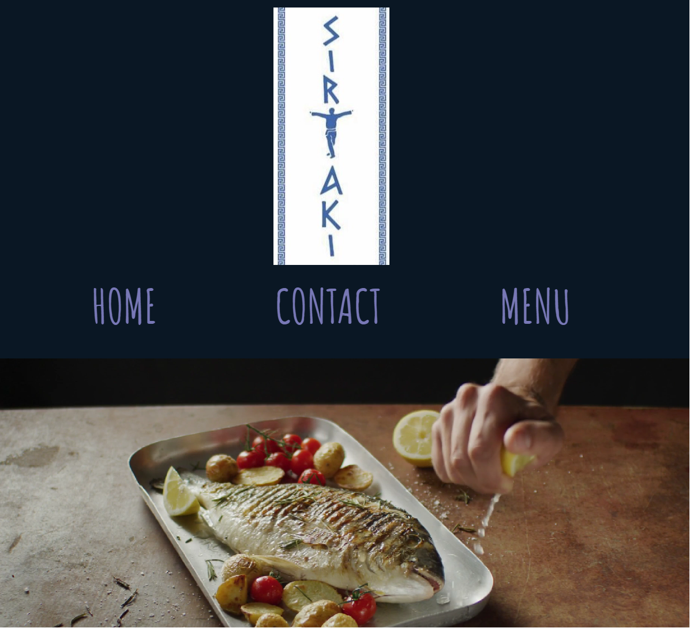
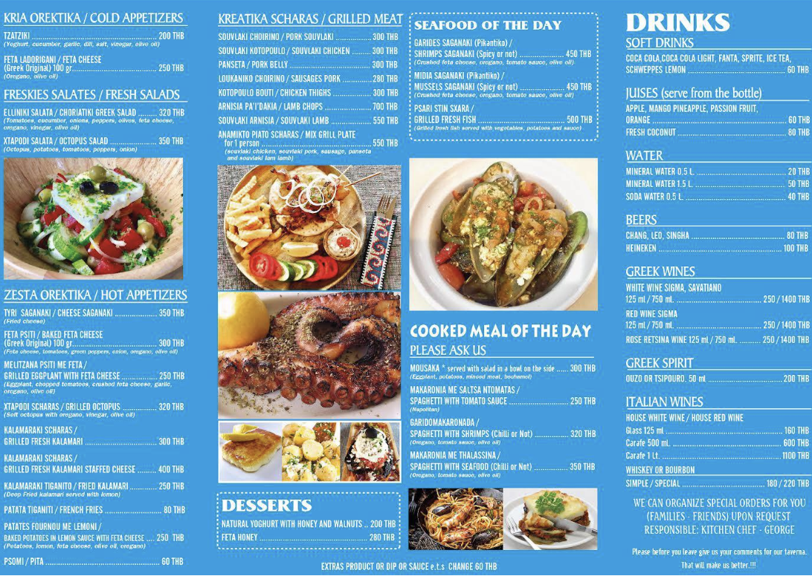
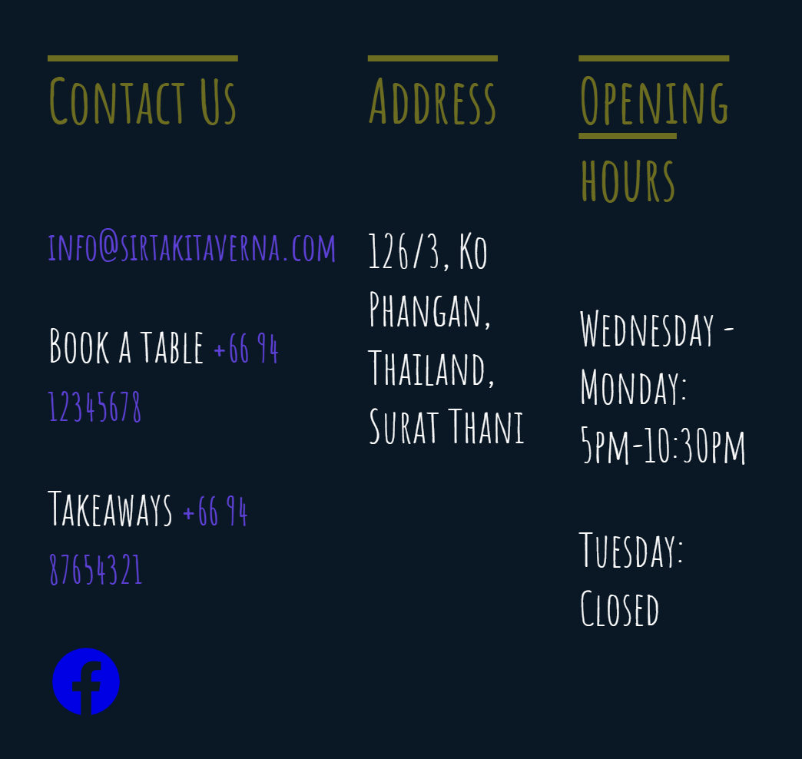

<h1 align="center"><a href="https://sirtaki-taverna.netlify.app/"><strong>Sirtaki Taverna Website</strong></a></h1>
<p align="center">
    
  

</p>

## About
This repository hosts the code for the Sirtaki Taverna website—a digital representation of the authentic Greek culinary experience situated on the island of Ko Pha Ngan, Thailand.

Developed as a final project for my HTML/CSS coursework, this is the website I built for my sister's restaurant. The project aims to showcase the restaurant's atmosphere, menu offerings, and customer reviews in an engaging and user-friendly manner.

## Features 
* __Interactive Menu__: Explore the delectable offerings with an easy-to-navigate menu section.
* __Customer Reviews__: Read what customers have to say about their dining experiences.
* __Contact Information__: Find details to get in touch, book a table, or order takeaways.
* __Responsive Design__: Ensures a seamless experience across various devices.

## Technologies used:


## How to use 
1. Ensure you have a modern web browser installed, such as Google Chrome, Mozilla Firefox, or Safari.
2. Clone the project repository to your local machine using the following command:

```bash
# Clone this repository
$ git clone https://github.com/lucid-dreamer11/greek-restaurant

# Go into the repository
$ cd greek-restaurant

# Open in browser
$ Open the HTML files (index.html, menu.html, contact.html) in your preferred web browser.

```
## Limitations
The website interface could be slightly perfected through the use of more advanced CSS/JS code. 

## Acknowledgements 
Thanking Alla's CanSheCode programming school for the inspiration with this study project. 
